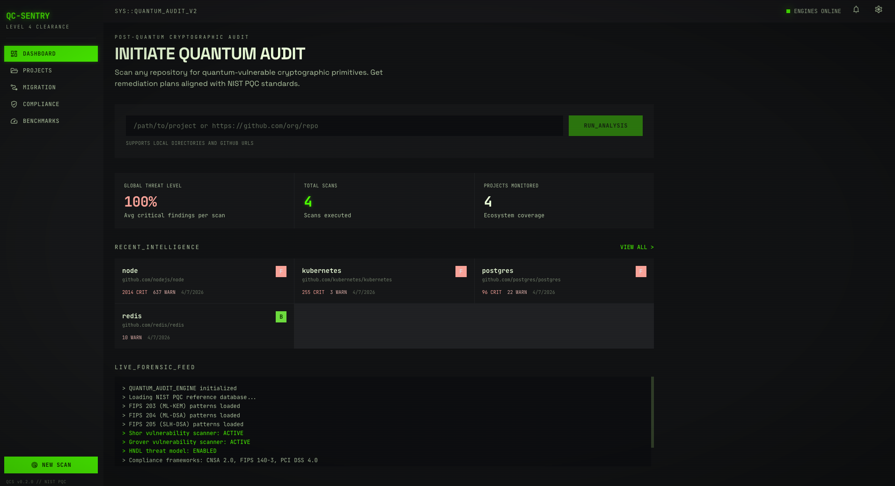
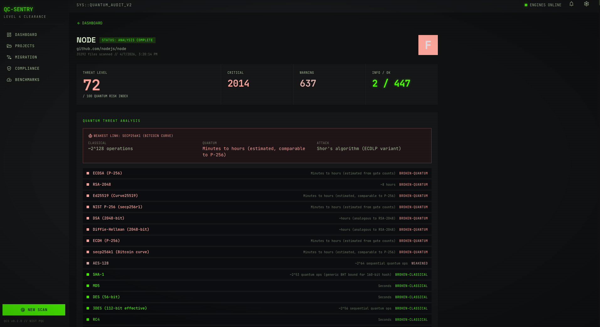
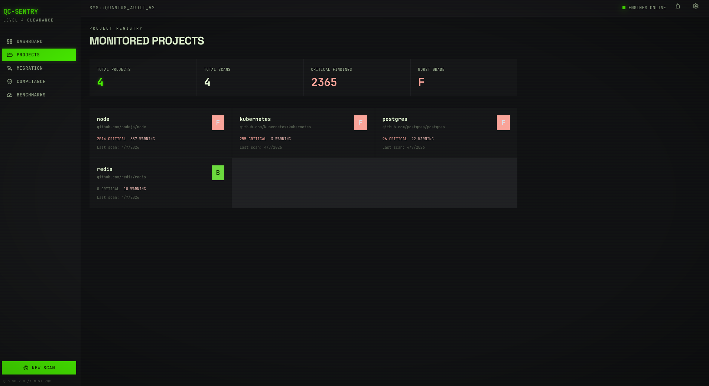
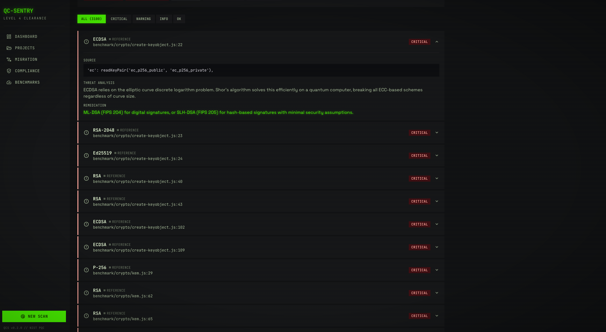
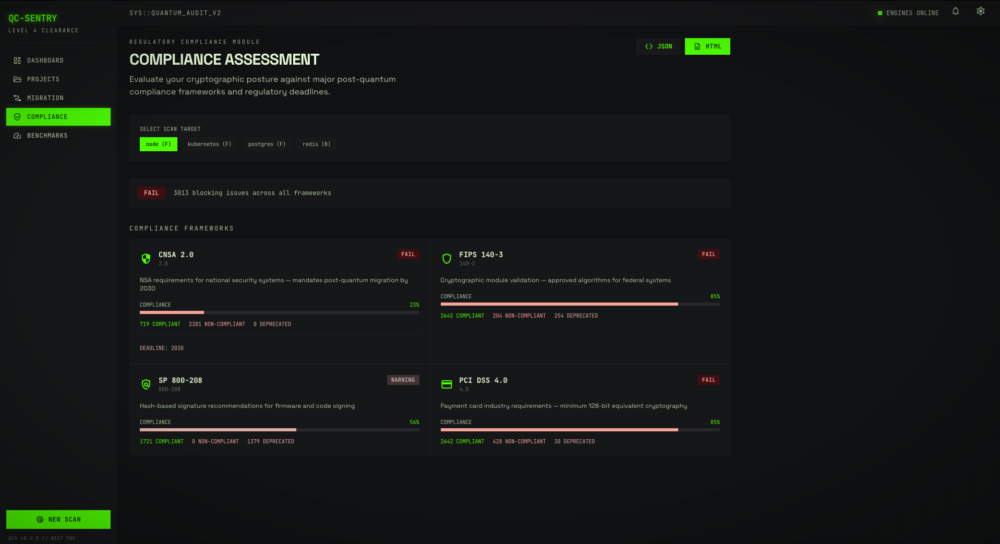
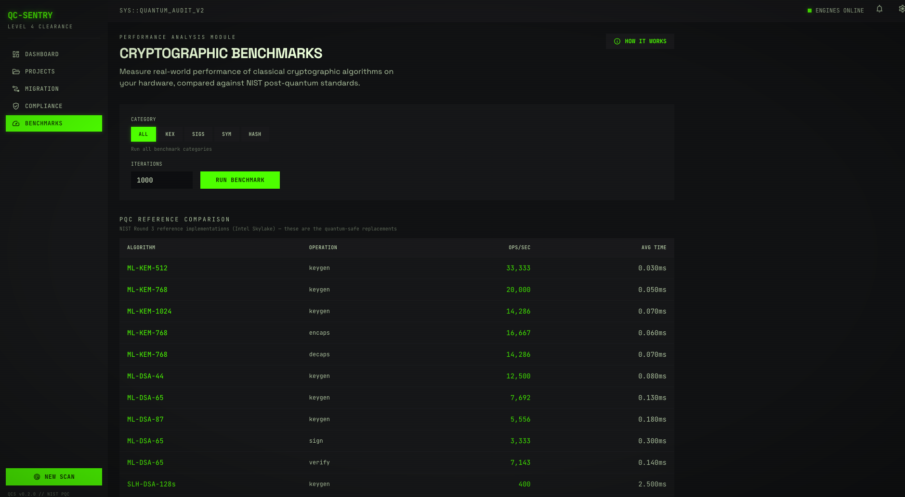

# qcrypt

[](https://www.npmjs.com/package/qcrypt-scan)
[](https://github.com/varmabudharaju/qcrypt/actions/workflows/ci.yml)
[](LICENSE)

Scan any codebase for **quantum-vulnerable cryptography**. Get a grade, see what breaks when quantum computers arrive, and know exactly what to fix.

**11 languages** &nbsp;·&nbsp; **Cited quantum break times** &nbsp;·&nbsp; **NIST deadline tracking** &nbsp;·&nbsp; **Diff-aware CI**



---

## Try it right now — hosted at qcrypt.dev

> **[https://qcrypt.dev](https://qcrypt.dev)** — paste any public GitHub URL and get an instant report. No signup, no install, runs in your browser.

If the repo you want to scan is **public**, the hosted UI is the fastest way to see what qcrypt does. For **private codebases or local folders**, use the CLI below — scans run entirely on your machine, nothing is uploaded.

---

## Table of Contents

- [Why this matters](#why-this-matters)
- [Three ways to use qcrypt](#three-ways-to-use-qcrypt)
- [Quick Start](#quick-start)
- [Local Dashboard](#local-dashboard)
- [CI integration (GitHub Action)](#ci-integration-github-action)
- [What it detects](#what-it-detects)
- [Languages and file types](#languages-and-file-types)
- [CLI reference](#cli-reference)
- [How it works](#how-it-works)
- [Research sources](#research-sources)
- [Troubleshooting](#troubleshooting)
- [Contributing](#contributing)
- [License](#license)

---

## Why this matters

RSA-2048 — the algorithm protecting most of the internet — can be broken in **~8 hours** by a sufficiently large quantum computer ([Gidney & Ekerå, 2021](https://doi.org/10.22331/q-2021-04-15-433)). NIST has set 2030 as the deprecation deadline and 2035 as the prohibition deadline for classical public-key crypto ([NIST IR 8547](https://csrc.nist.gov/pubs/ir/8547/ipd)).

Most codebases have no idea where their crypto lives or how exposed they are. **qcrypt** finds every cryptographic primitive in your code, classifies how it's used, tells you exactly how long you have, and shows you what to migrate to.

The threat is not theoretical. **"Harvest now, decrypt later"** attacks — adversaries archiving encrypted traffic today to decrypt once quantum hardware exists — make this a present-day concern, not a future one.

---

## Three ways to use qcrypt

| For | Use | What you get |
|---|---|---|
| Quick look at a public repo | [**qcrypt.dev**](https://qcrypt.dev) (hosted) | Instant grade in your browser, no install |
| Private code or local folders | **CLI** (`npx qcrypt-scan`) | Scans on your machine, nothing uploaded |
| Every PR in your project | **GitHub Action** | Diff-aware PR comments — only flags new findings |

---

## Quick Start

### Option 1 — Hosted (zero install, public repos only)

Open **[qcrypt.dev](https://qcrypt.dev)**, paste a GitHub URL, hit RUN_ANALYSIS.

### Option 2 — CLI via npx (zero install, scans run locally)

```bash
# Scan a public GitHub repo
npx qcrypt-scan https://github.com/nodejs/node

# Scan a private project on your machine
npx qcrypt-scan /path/to/your/project

# Scan the current directory, get JSON for scripting
npx qcrypt-scan . --json

# Open the local web dashboard with folder picker
npx qcrypt-scan --serve --open
```

The first run downloads the package (~5 seconds). Subsequent runs are instant from cache.

### Option 3 — Install globally

```bash
npm install -g qcrypt-scan
qcrypt-scan --serve --open
```

### Option 4 — Build from source (contributors)

```bash
git clone https://github.com/varmabudharaju/qcrypt.git
cd qcrypt
npm install                          # auto-builds CLI + web dashboard
node dist/cli.js --serve --open
```

> **Coming soon:** `pip install qcrypt-scan` for the Python ecosystem. Until then, the npm distribution above works on every platform with Node 18+.

---

## Local Dashboard

Run `qcrypt-scan --serve --open` and a full web UI launches at `http://localhost:3100`. This is the **same interface** as qcrypt.dev — but pointed at your own machine, with extra capabilities the cloud version can't have.



**What the local dashboard adds beyond the hosted version:**

- **Folder picker.** Click `BROWSE`, navigate your filesystem under `$HOME`, and scan any directory. Path traversal is blocked at the API level.
- **Local-path scanning via the input box.** Paste an absolute path like `/Users/you/project` instead of a URL.
- **Persistent project tracking** in a local SQLite database — track grades over time across multiple repos.



**Other features available in both versions:**

- **Usage classification.** qcrypt distinguishes actual crypto operations (`rsa.GenerateKey()`) from imports, key material, references, and comments. Comments are excluded from scoring; imports weigh less than operations. This dramatically reduces false-positive noise.

  

- **Compliance assessment** against CNSA 2.0, FIPS 140-3, NIST SP 800-208, and PCI DSS 4.0.

  

- **PQC benchmarks.** Benchmark classical crypto on your hardware and compare against NIST post-quantum reference data.

  

- **Migration plans** with code examples, dependency lists, and effort estimates.

---

## CI integration (GitHub Action)

Add quantum crypto scanning to every pull request. The action is **diff-aware** — it only reports findings introduced by the PR, not pre-existing tech debt.

```yaml
name: Quantum Crypto Scan
on:
  pull_request:
    branches: [main]

permissions:
  contents: read
  pull-requests: write

jobs:
  qcrypt:
    runs-on: ubuntu-latest
    steps:
      - uses: actions/checkout@v4
      - uses: varmabudharaju/qcrypt@v1
        with:
          fail-on: critical          # also accepts: warning, info, off
```

The action posts a comment on the PR:

```
## qcrypt-scan — Quantum Crypto Audit

Grade: B → D  |  New: 3 findings  |  Resolved: 0

| Risk     | Algorithm | Location        | Type      |
|----------|-----------|-----------------|-----------|
| CRITICAL | RSA-2048  | src/auth.go:45  | operation |
| WARNING  | MD5       | src/hash.go:12  | operation |

> Quantum Threat: RSA-2048 — breakable in ~8 hours (Shor's algorithm)
```

---

## What it detects

| Algorithm | Risk | Quantum Attack | Break Time |
|-----------|------|---------------|------------|
| RSA (all sizes) | CRITICAL | Shor's algorithm | ~8 hours (2048-bit) |
| ECDSA, ECDH, Ed25519 | CRITICAL | Shor's algorithm | Minutes to hours |
| DH, DSA | CRITICAL | Shor's algorithm | ~hours |
| AES-128 | WARNING | Grover's algorithm | Reduced to 64-bit security |
| MD5, SHA-1 | WARNING | Classically broken | Already broken |
| DES, 3DES, RC4 | WARNING | Classically broken | Already broken |
| AES-256, SHA-256, SHA-3 | OK | Quantum-safe | No migration needed |

Every finding cites peer-reviewed research. See [`src/reference/quantum-estimates.ts`](src/reference/quantum-estimates.ts) for full citations.

---

## Languages and file types

**Source code** — Python, JavaScript, TypeScript, Go, Rust, Java, Kotlin, C, C++, Ruby, PHP.

**Certificates** — `.pem`, `.crt`, `.key` files are parsed for actual key type and key size using Node's built-in crypto module.

**Configuration** — nginx, sshd, haproxy, and OpenSSL config files are scanned for protocol versions and cipher selections.

**Dependency manifests** — `package.json`, `go.mod`, `requirements.txt`, `Cargo.toml` are checked for crypto libraries with known weaknesses.

A **language coverage warning** appears in the report when the project's primary language isn't on the supported list, so you know the score is incomplete rather than confidently wrong.

---

## CLI reference

```bash
# Scanning
qcrypt-scan [path-or-github-url]              # Terminal output (default)
qcrypt-scan . --json                          # JSON
qcrypt-scan . --sarif                         # SARIF 2.1.0 — for security tools
qcrypt-scan . --cbom                          # CycloneDX 1.6 CBOM — for SBOM tools

# CI mode
qcrypt-scan . --ci --fail-on C                # Exit 1 if grade is C or worse
qcrypt-scan ci init --provider github         # Scaffold a CI workflow file
qcrypt-scan ci diff --pr a.json --base b.json # Diff two scan reports

# Migration
qcrypt-scan migrate [path]                    # Generate migration plan
qcrypt-scan migrate . --markdown              # Write migration-plan.md

# Benchmarks
qcrypt-scan bench                             # All categories
qcrypt-scan bench --category kex --json       # Just key exchange, JSON

# Web dashboard
qcrypt-scan --serve                           # Start on port 3100
qcrypt-scan --serve --open                    # ...and open it in your browser
qcrypt-scan --serve --port 8080               # Custom port

# Help and version
qcrypt-scan --help
qcrypt-scan --version
```

---

## How it works

1. **Discover** — walks the codebase and classifies files by language.
2. **Scan** — language-aware regex matching for crypto APIs across stdlib, OpenSSL, and common libraries.
3. **Classify** — every finding is tagged as `operation`, `import`, `key-material`, `config`, `reference`, or `comment`.
4. **Parse** — certificates and keys are parsed for actual key type and size via Node's native crypto module (not just regex).
5. **Score** — multi-dimensional readiness: vulnerability severity, migration effort, crypto agility.
6. **Analyze** — quantum break times pulled from peer-reviewed research; NIST compliance deadlines applied.
7. **Report** — terminal, JSON, SARIF, CBOM, HTML, or live web dashboard.

The scanner uses **regex pattern matching, not AST parsing**. This means broad language coverage with ~85–90% precision and occasional false positives from string literals or documentation. Usage classification (operations vs imports vs comments) significantly reduces noise. AST-based scanning would improve precision but at the cost of language-specific parsers per ecosystem.

---

## Research sources

| Source | Used For |
|--------|----------|
| [Gidney & Ekerå (2021)](https://doi.org/10.22331/q-2021-04-15-433) | RSA-2048 quantum break time: ~8 hours, 20M physical qubits |
| [Roetteler et al. (2017)](https://doi.org/10.1007/978-3-319-70697-9_9) | ECC quantum resource estimates: ~2,330 logical qubits for P-256 |
| [Grassl et al. (2016)](https://doi.org/10.1007/978-3-319-29360-8_3) | AES quantum circuit costs: 2,953 / 6,681 qubits for AES-128 / 256 |
| [NIST IR 8547 (2024, draft)](https://csrc.nist.gov/pubs/ir/8547/ipd) | PQC transition timelines: 2030 deprecation, 2035 prohibition |
| [Proos & Zalka (2003)](https://arxiv.org/abs/quant-ph/0301141) | Elliptic curve discrete log: ~6n qubits for n-bit curve |

---

## Troubleshooting

**`Port 3100 is already in use`** — something else is running on that port (often a previous `--serve` you forgot to stop). Either run with `--port 3101` or stop the old process:
```bash
kill $(lsof -tiTCP:3100 -sTCP:LISTEN)
```

**`npm install` fails with `EBADPLATFORM`** — make sure you have Node 18 or newer (`node --version`). Older Node versions don't support some of qcrypt's dependencies.

**`--serve` returns 503 with "qcrypt web UI is not built"** — the web bundle didn't build. Run `npm run build:web` from the repo root and restart.

**Folder picker shows "Access denied"** — for safety, the picker only browses directories under your home folder (`$HOME`). To scan something outside that, paste the absolute path directly into the text input instead.

**Got false positives from docstrings or comments** — qcrypt classifies findings as `operation`, `import`, `comment`, etc. Comments are excluded from scoring by default. If you're seeing comments in the findings list, they're informational only and don't affect the grade.

---

## Contributing

Issues and pull requests are welcome at [github.com/varmabudharaju/qcrypt](https://github.com/varmabudharaju/qcrypt). Run the test suite with `npm test` before submitting (174 tests across CLI, API, scanners, and benchmarks).

For larger changes, please open an issue first to discuss the approach.

---

## License

MIT — see [LICENSE](LICENSE) for the full text.
